<p align="center">


# How to generate a 1M random users serverless database in AWS using Serverless Application Model (AWS SAM) + AWS Glue + AWS Athena + python
</p>

A tutorial on how to build a scalable architecture in AWS to generate random data, using Lambda Functions, S3 storage, AWS Glue, AWS athena and python

The tutorial focuses on: 

1. write data in json format using AWS SAM,
2. create an AWS GlueJob to transform json(read json) to parquet(write parquet),
3. add an AWS LambdaFunction to trigger GlueJob for each json document (write 1 parquet for each 1 json)
4. write data concurrently using AWS SAM mapped function
    + invoke AWS LambdaFunction concurrently
    + start AWS GlueJob concurrently
6. explore data using AWS Athena

The following ìmgs/imgs/image represents the pipeline in a graphic way.

<p align="center">
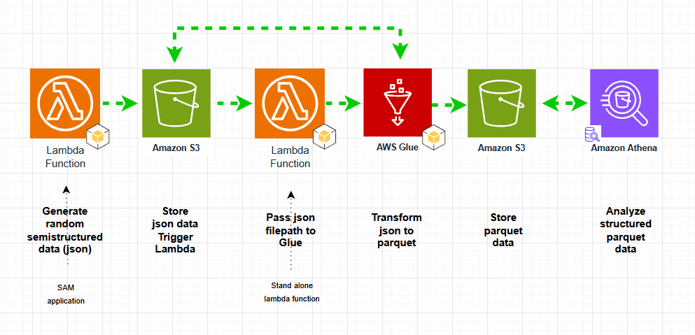
</p>


## Table Of Contents

- [Generate data](#Generate-data)
    - Install AWS Serverless Application Model
    - Write json data to S3 using faker and AWS SAM Function
    - Deploy AWS SAM function
    - Invoke AWS SAM function

- [Transform data](#Transform-data)
    - Transform json to parquet with AWS Glue
    - Save parquet to S3

- [Trigger process](#Trigger)
    - Create a Lambda function to start AWS Glue Job
    - Create a S3 trigger

- [Test process](#Invoke)
    - Invoke process concurrently using AWS SAM

- [Analyze data](#Analyze)
    - Query data in AWS Athena

- [Estimate cost](#Estimate)
    - Estimate cost using AWS Cost Estimator

## Generate-data
#### 1. Install AWS Serverless Application Model

Install [AWS SAM](https://docs.aws.amazon.com/serverless-application-model/latest/developerguide/install-sam-cli.html) 

Create a working folder

`mkdir sam-apps`

`cd sam-apps`

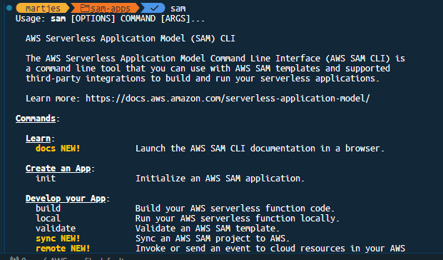

Create a new application using command:

`sam init`

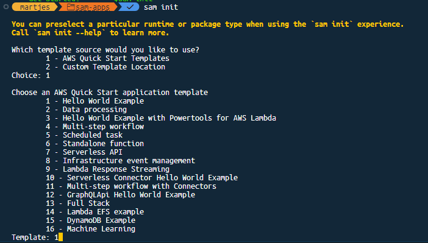

Choose: 
- 1, 
- 1, 
- N, 
- choose your python dist (20), 
- 1, 
- N, 
- N, 
- N, 
- choose a project name

A folder with a new SAM application should 

Check the Hello-World Function available [here](SAM-README.md)

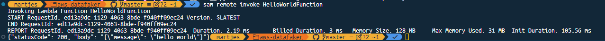

#### 2. Write json data to S3 using faker and AWS SAM Function

Clone [repository](https://github.com/chisus089/aws-datafaker) to local.

Check application at functions/datafaker/app.py

`git clone https://github.com/chisus089/aws-datafaker`

`cd aws-datafaker`

Review the detail on how to generate a json with random data using python at:

`nano functions/datafaker/app.py`

```
from datetime import datetime, timedelta
from random import randint, random
from uuid import uuid4
from faker import Faker
from uuid import uuid4
import json
import boto3    

BUCKET = 'aws-root-main-datafaker-json-trigger'

def gen_datetime(min_year=2020, max_year=datetime.today().year):
    """
    generate a datetime in format yyyy-mm-dd hh:mm:ss.000000
    """

    start = datetime(min_year, 1, 1, 00, 00, 00)
    years = max_year - min_year + 1
    end = start + timedelta(days=365 * years)
    response = start + (end - start) * random()
    return response


def create_json():
    """
    Generates dummy spark dataframe.
    """
    fake = Faker()
    fake_age = randint(18, 50)
    min_year = datetime.now().year - fake_age
    fake_dob = gen_datetime(min_year=min_year, max_year=min_year).strftime(
        "%Y-%m-%d"
    )
    struct =  {
        "uuid": str(uuid4()),
        "name": fake.name(),
        "email": fake.email(),
        "phone": fake.basic_phone_number(),
        "nationality": fake.country(),
        "address": fake.address(),
        "salary": randint(10000, 1000000),
        "age": fake_age,
        "dob": fake_dob,
        "join_date": gen_datetime().isoformat()
    }

    key = struct['join_date'][:10] + "/" + struct['uuid']
    struct['json_path'] = f's3://{BUCKET}/hdfs/hdfs-fakedatabase/json/{key}.json'

    return struct

def save_json_to_s3(json_data):
    """_summary_

    Args:
        json_data (_type_): _description_

    Returns:
        _type_: _description_
    """
    s3 = boto3.resource('s3')
    
    key=json_data['json_path'].split("/")[-2]
    filename=json_data['json_path'].split("/")[-1]
    
    s3object = s3.Object(BUCKET, f'hdfs/hdfs-fakedatabase/json/{key}/{filename}')
    tosave_object = (bytes(json.dumps(json_data).encode('UTF-8')))
    
    s3object.put(Body=tosave_object)

    return tosave_object

def lambda_handler(event, context):
    """_summary_

    Args:
        event (_type_): _description_
        context (_type_): _description_

    Returns:
        _type_: _description_
    """
    json_doc=create_json()
    body=save_json_to_s3(json_doc)

    return body

```

Json document generated is saved to S3 using boto3.

More information on Faker, a Python package that generates fake data [here](https://pypi.org/project/Faker/). 

#### 3. Deploy AWS SAM function

After properly setting AWS local environment credentials, and properly install AWS SAM, deploy your folder with applications using `sam deploy` command. Follow instructions given by using parameter `--guided`.

`cd aws-datafaker`

`sam deploy --guided`

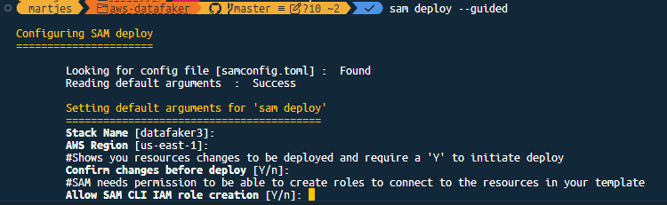


#### 4. Invoke AWS SAM function


`sam remote invoke HelloWorldFunction`

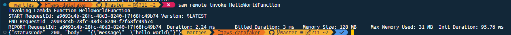


`sam remote invoke DataFaker3Function`

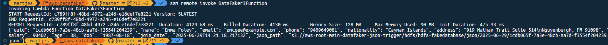


## Transform-data
#### 5. Transform json to parquet with AWS Glue

Create a new AWS Glue Job with the following code:

`nano glue_functions/s3JsonToS3Parquet.py`

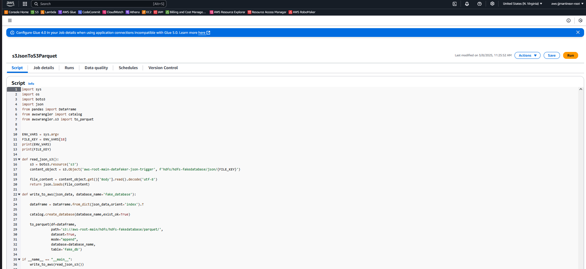

Add the following job parameters.

- `--additional-python-modules` to add additional required libraries

- `--FILE_KEY` to add a path to a json file generated with faked for manual test

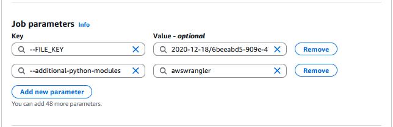

#### 6. Save parquet to S3

Run `s3JsonToS3Parquet.py`. Go to S3 to view the parquet files.

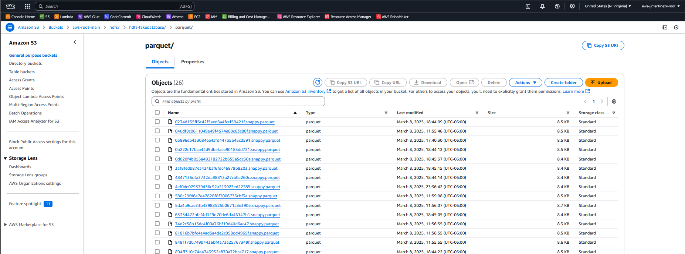


## Trigger
#### 7. Create a TriggerLambda function to start AWS Glue Job

Follow https://docs.aws.amazon.com/lambda/latest/dg/with-s3-example.html instructions to create a lambda function that monitors a given folder and invokes a glue job

`nano functions/s3_trigger/s3LambdaTriggerFunction.py`


#### 8. Associate the TriggerLambda to a S3 bucket

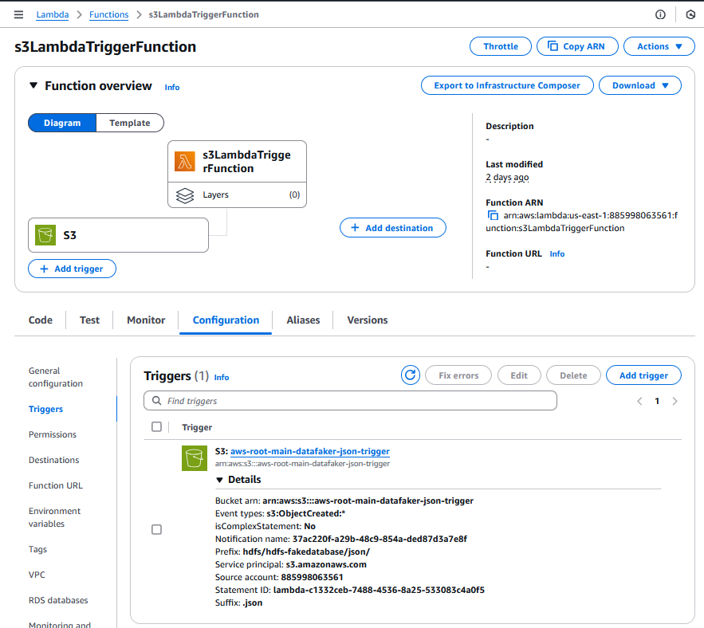

## Invoke
#### 9. Invoke process concurrently using AWS SAM

Go to AWS console, and the to the deployed gluejob, change maximum concurrency to 5 ot 10 for following part. 

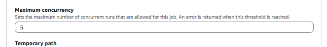


Invoke previously deployed lambda function concurrently by using a map function. The lambdas will be executed in parallel, and then each lambda will call an independent glue job.

You can set the value to 10k, 100k, or 1M to generate any given number of users in parallel. BEWARE the cost incurred by running 1M parallel lambdas.

`sam remote invoke MappedDataFaker3Function --event-file events/event1.json`


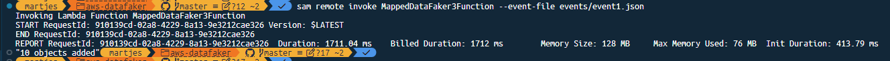

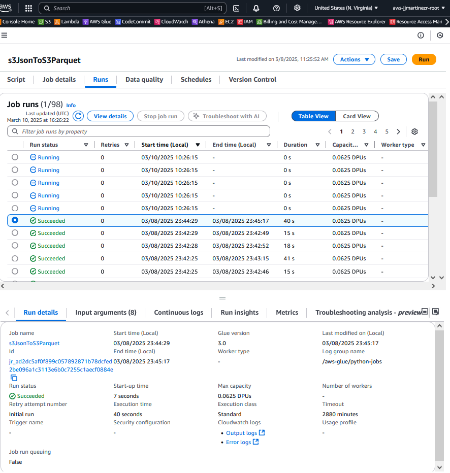

Review that argument --FILE_KEY is being passed correctly:

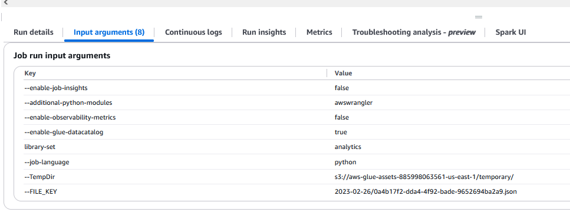

## Analyze
#### 10. Query data in AWS Athena

Use athena to query the parquet files created:

`SELECT * FROM "fake_database"."fake_db" limit 100;`


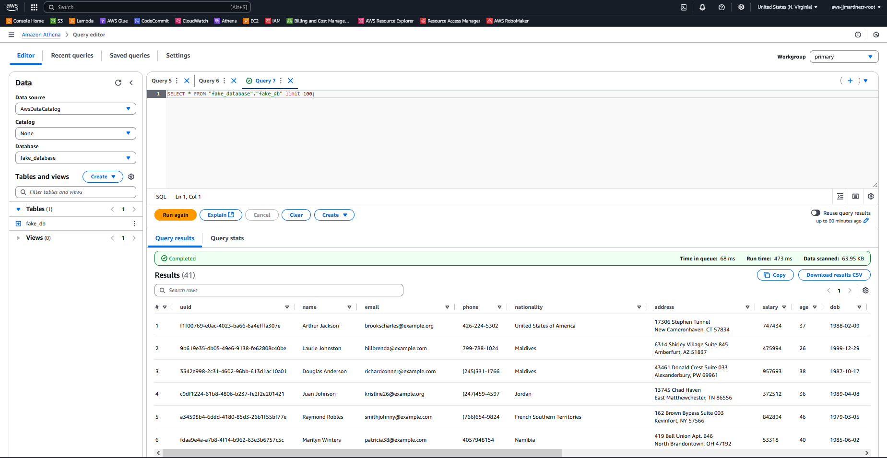

## Cost estimation

https://calculator.aws/#/createCalculator/Lambda

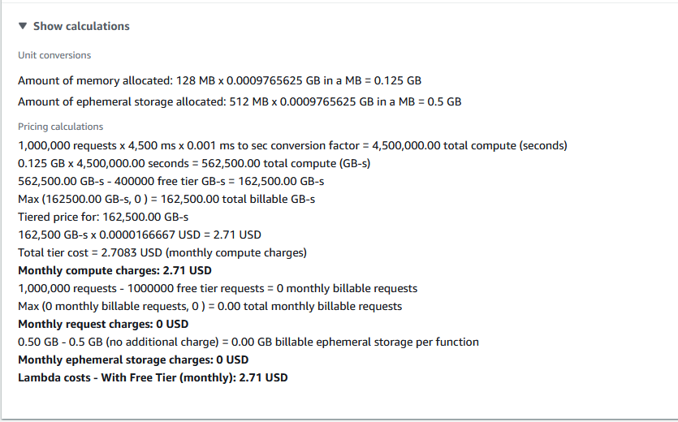

Estimating a job of 45s per 1000000 executions ~ 340 USD

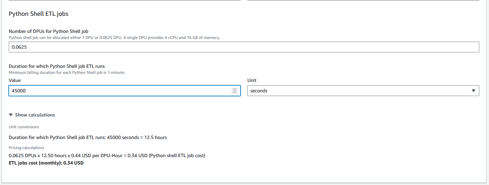

## To-do


## Team


[Jesus Jorge Martinez Rios](https://www.linkedin.com/in/jesusjmartinezr/) 

## [License](https://github.com/chisus089/flight_data_tutorial/blob/main/LICENSE)

© Jesus Jorge Martinez Rios 

[jesus.martinez89@hotmail.com](jesus.martinez89@hotmail.com)